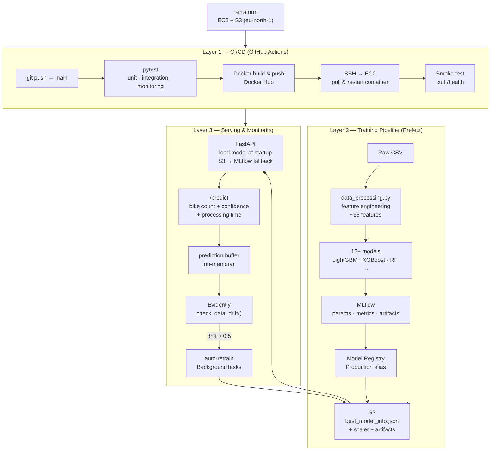

# Seoul Bike Sharing Prediction (MLOps Pipeline)

End-to-end MLOps pipeline predicting hourly bike rental demand in Seoul. Covers training, experiment tracking, model serving, monitoring, and automated deployment.

## Data

**Seoul Bike Sharing Demand** — [UCI ML Repository](https://archive.ics.uci.edu/ml/datasets/Seoul+Bike+Sharing+Demand)

- 8,760 instances (1 year of hourly data)
- Target: hourly rented bike count
- Features: weather conditions, time, season, holiday

Citation: Seoul Bike Sharing Demand [Dataset]. (2020). UCI Machine Learning Repository. https://doi.org/10.24432/C5F62R

## 📚 Stack

| Layer | Tool |
|-------|------|
| Training | scikit-learn, LightGBM, XGBoost |
| Experiment tracking | MLflow |
| Orchestration | Prefect |
| Serving | FastAPI + Docker |
| Monitoring | Evidently |
| Infrastructure | AWS EC2 + S3, Terraform |
| CI/CD | GitHub Actions |

## Architecture



## Setup

```bash
# macOS dependency (LightGBM requires libomp)
brew install libomp

# Create virtual environment and install dependencies
uv venv .venv
source .venv/bin/activate
uv pip install -r requirements.txt

# Set environment variables (or run scripts/server-start.sh)
export AWS_REGION="eu-north-1"
export S3_BUCKET_NAME="seoul-bike-sharing-aphdinh"
export MLFLOW_TRACKING_URI="sqlite:///mlflow.db"
export MLFLOW_ARTIFACT_URI="s3://seoul-bike-sharing-aphdinh/mlflow-artifacts/"
```

## Usage

```bash
make train          # train all models, register best to MLflow + S3
make train-prefect  # same via Prefect orchestration
make api            # start FastAPI on port 8000
make test           # run test suite
```

## Predict

```bash
curl -X POST "http://localhost:8000/predict" \
  -H "Content-Type: application/json" \
  -d '{
    "date": "15/06/2018", "hour": 8,
    "temperature_c": 20.0, "humidity": 60.0,
    "wind_speed": 2.0, "visibility_10m": 1500.0,
    "dew_point_c": 10.0, "solar_radiation": 1.5,
    "rainfall_mm": 0.0, "snowfall_cm": 0.0,
    "season": "Summer", "holiday": "No Holiday",
    "functioning_day": "Yes"
  }'
```

Swagger UI: `http://localhost:8000/docs`

## Monitoring

```bash
curl http://localhost:8000/monitoring/status
curl -X POST http://localhost:8000/monitoring/data-drift
curl -X POST http://localhost:8000/monitoring/data-quality
```

Reference data (training distribution) is saved automatically after each training run. Each `/predict` call accumulates into the current data buffer for drift comparison.

## Model Performance

Best model: **LightGBM** — R² 0.85–0.94, RMSE 200–400 bikes

## Project Structure

```
├── src/
│   ├── api/          # FastAPI app
│   ├── training/     # training pipeline + Prefect orchestrator
│   ├── monitoring/   # Evidently drift detection
│   ├── models/       # model definitions, hyperparameter tuning
│   ├── data/         # data loading, feature engineering
│   └── utils/        # MLflow + AWS helpers
├── tests/            # unit + integration tests
├── data/             # training data + reference data for monitoring
├── notebook/         # EDA notebooks
├── terraform/        # infrastructure as code (EC2, S3)
├── scripts/          # environment setup
├── artifacts/        # generated models and reports
├── Dockerfile
├── Makefile
└── requirements.txt
```
